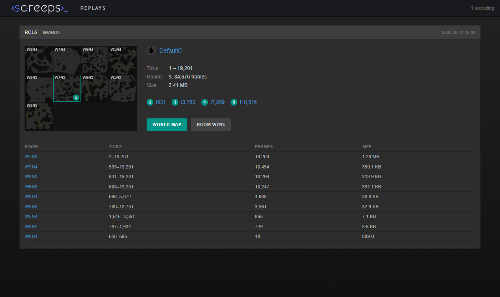

# xxscreeps-replay

Room recorder and replay viewer for [xxscreeps](https://github.com/laverdet/xxscreeps).

The mod records every room a player is in, every tick, into small `.xrr` files.
You can then scrub through a recording in the official client's history view
(the same UI screeps.com uses for room history) or on a world map with a
playback bar. Recordings stay watchable after the world they came from has been
reset.

I wrote it to look at bot speedruns on a private server. A full run to RCL5
(about 19,000 ticks over nine rooms) takes 2.4 MB of disk.



## Requirements

- An [xxscreeps](https://github.com/laverdet/xxscreeps) server. Node 22.15 or
  newer records with zstd; older Node falls back to brotli (about 6% larger
  files) and cannot read zstd recordings made elsewhere.
- [`@xxscreeps/client`](https://github.com/laverdet/xxscreeps/tree/main/packages/client),
  the mod that serves the official browser client from your Steam install of
  Screeps. All playback happens in that client, so without it there is nothing
  to look at. Its README explains where it finds `package.nw`.
- Optional: a checkout of [shardreplay](https://github.com/DefaultO/shardreplay)
  if you want the world map view.

## Setup

1. Install the mod in the directory that holds your `.screepsrc.yaml`:

   ```sh
   npm install github:DefaultO/xxscreeps-replay
   npm install @xxscreeps/client   # if you don't have the browser client yet
   ```

2. Add both mods to `.screepsrc.yaml` and tell the recorder whose rooms to
   record:

   ```yaml
   mods:
     - xxscreeps/mods/classic
     - xxscreeps/mods/backend/cookie
     - xxscreeps/mods/backend/password
     - xxscreeps-replay
     - '@xxscreeps/client'

   replay:
     dir: ./replays
     users: [YourName]
   ```

   Without `users` every player is recorded, including the NPC bots that come
   with a generated world.

3. Start the server. The log shows where it records:

   ```
   replay: recording to /path/to/replays/2026-09-12T10-47-12 (chunks of 200 ticks, zstd)
   ```

4. Open `http://localhost:21025/replay/`.

5. For the world map, clone shardreplay somewhere and point the mod at its
   `web` directory:

   ```yaml
   replay:
     viewer: ../shardreplay/web
   ```

## Usage

`/replay/` lists all recordings in the replay directory. Each entry shows the
recorded rooms as map tiles, the player, the controller levels reached, and a
table of rooms. Click a tile or a room name to open that room in the client's
history view, or the level markers to jump to the tick a level was reached.

**Room view.** The official client's history mode. Play, pause, change the
speed, drag the slider. The slider is limited to the ticks that were recorded
for that room and moves one tick at a time.

**World map.** The shardreplay viewer over the whole recording. Space plays,
arrow keys step, `+` and `-` change speed, `/` searches for a room. Controller
level changes and invader raids are marked on the timeline.

Both views work while a recording is still being written.

### Naming recordings

By default a recording is named after the time it started. To name it
yourself:

- `replay.name` in the config sets a fixed name.
- `XX_REPLAY_NAME=run-42` in the server's environment names the recording of
  that start. Useful for scripts that start the server per experiment.
- `XX_REPLAY=0` starts the server without recording, for example to look at old
  recordings.

### Stopping the server

Chunks are written every 200 ticks. If the server is killed, the ticks since
the last chunk are lost. Before killing it, call

```sh
curl -X POST http://localhost:21025/replay/flush
```

This writes the open chunks and also saves the world database, which xxscreeps
otherwise only does on its own schedule.

`GET /replay/status` returns frame and byte counts of the current recording.

### Badges

Recordings keep each player's badge, so replays show it even after the player
is gone from the server. Users created on a private server have no badge at
all; the mod then draws a plain disc.

The easiest way to give a user a badge is a file. Create a `badges` directory
next to `.screepsrc.yaml` (or set `replay.badges`) and put one of these in it:

- `badges/<username>.json`, a badge object. To use your persistent-world
  badge, save what `https://screeps.com/api/user/find?username=<username>`
  returns; the mod accepts the whole response or just the `badge` part. The
  recorder stores the badge for that user as soon as it sees them, so the
  client draws it everywhere, and the recording keeps a copy.
- `badges/<username>.svg`, an image. It is served as that user's badge image
  wherever a badge is shown as an image (the world map, the room view's owner
  icon). Nothing is written to the database.

Files are re-read when they change; no restart needed.

The same can be done over the API, for example from a script that sets up
users. Sign in to get a token, then post the badge with it:

```sh
TOKEN=$(curl -s -X POST http://localhost:21025/api/auth/signin \
  -H 'Content-Type: application/json' \
  -d '{"email": "<username>", "password": "<password>"}' | jq -r .token)

curl -X POST http://localhost:21025/replay/badge \
  -H 'Content-Type: application/json' -H "X-Token: $TOKEN" \
  -d '{"badge": {"type": {"path1": "...", "path2": "..."}, "color1": "#...", "color2": "#...", "color3": "#..."}}'
```

`/api/auth/signin` is the password login xxscreeps ships
(`xxscreeps/mods/backend/password`); the `email` field takes the username.
Every authenticated request carries the token in the `X-Token` header, and
the server may answer with a new token in its own `X-Token` header, which
replaces the old one.

xxscreeps' own `/api/user/badge` only accepts the 24 built-in shapes;
`/replay/badge` also takes custom badges, which is what the persistent world
gives most players.

## Configuration

All keys under `replay:` in `.screepsrc.yaml`.

| key | default | |
|---|---|---|
| `enabled` | `true` | record at all |
| `dir` | `./replays` | one subdirectory per recording |
| `name` | start time | recording name |
| `users` | all players | user names or ids whose rooms are recorded |
| `rooms` | | fixed room list instead of `users` |
| `chunkTicks` | `200` | ticks per chunk, keyframe every chunk |
| `historyChunkSize` | `100` | ticks per request from the client, divides `chunkTicks` |
| `codec` | `zstd` | `zstd`, `brotli` or `none` |
| `level` | codec default | compression level |
| `asUser` | the only player | render as this user (affects private `say` messages) |
| `viewer` | | path to shardreplay's `web` directory |
| `badges` | `./badges` | directory of `<username>.json` and `<username>.svg` badge files |
| `log` | `true` | progress line every 1000 ticks |

Environment variables `XX_REPLAY`, `XX_REPLAY_NAME`, `XX_REPLAY_DIR`,
`XX_REPLAY_VIEWER` and `XX_REPLAY_BADGES` override `enabled`, `name`, `dir`,
`viewer` and `badges`.

## Command line

```sh
npx xrr info    replays/run-42            # rooms, ticks, sizes
npx xrr dump    replays/run-42 W7N3 1500  # one room at one tick, as JSON
npx xrr history replays/run-42 W7N3 1500  # a 100-tick window as the client receives it
npx xrr verify  replays/run-42            # decode everything, check tick order
npx xrr keys    replays/run-42 W7N3       # which fields take up the bytes
npx xrr recode  replays/run-42 W7N3 brotli
```

## How it works

Recording runs in the backend process and does not touch the processor. Each
tick it loads the rooms the configured players have presence in (creeps or
structures), renders every object the way the room socket renders it for the
client, and appends the result to the room's recording. A room is picked up the
tick its spawn is placed. Rooms nobody is in are not recorded.

Each room is a file of chunks. A chunk covers `chunkTicks` ticks and starts
with a full keyframe; the following frames only store what changed. Every
object is flattened to field paths, and for each numeric field the encoder
keeps the last value and the last two deltas. If the last two deltas agree it
predicts the trend continues (a creep walking in a line, a source being
harvested at a constant rate, a countdown), otherwise it predicts no change.
Only the difference from the prediction is stored. The chunk is then
compressed with zstd.

On a bot run to RCL5 the busy home room came to about 70 bytes per tick and
remote rooms to 5 to 25 bytes per tick. `xrr keys` tells you which fields cost
the most; in practice it is creep positions.

`meta.json` in each recording holds the players, the terrain of each room,
tick ranges, and the events shown on the timeline. `terrain.bin` holds the
whole world's terrain for the map view.

## URLs the mod serves

- `/replay/` the index.
- `/replay/<name>/` the official client, wired to that recording. Room links
  use the client's replay codes: `#!/history/<shard>/<room>?t=<tick>&code=<name>~<room>`.
- `/replay/<name>/map/` the world map (needs `viewer`).
- `/replay/flush`, `/replay/status`, `/replay/badge` as described above.
- `/room-history/<shard>/<room>/<tick>.json` the recording in progress, for the
  history button of the live client.

## Development

```sh
git clone https://github.com/DefaultO/xxscreeps-replay
cd xxscreeps-replay
npm install
npm run build
npm test
```

`dist/` is committed so that installing from GitHub needs no build. To run a
development checkout inside a server, link it into the server's
`node_modules/xxscreeps-replay` (a symlink or junction). Don't install a second
copy of xxscreeps next to the mod: the engine's hook registries are module
level singletons, and a mod that imports its own copy of xxscreeps registers
its hooks into the wrong one.

## License

MIT
